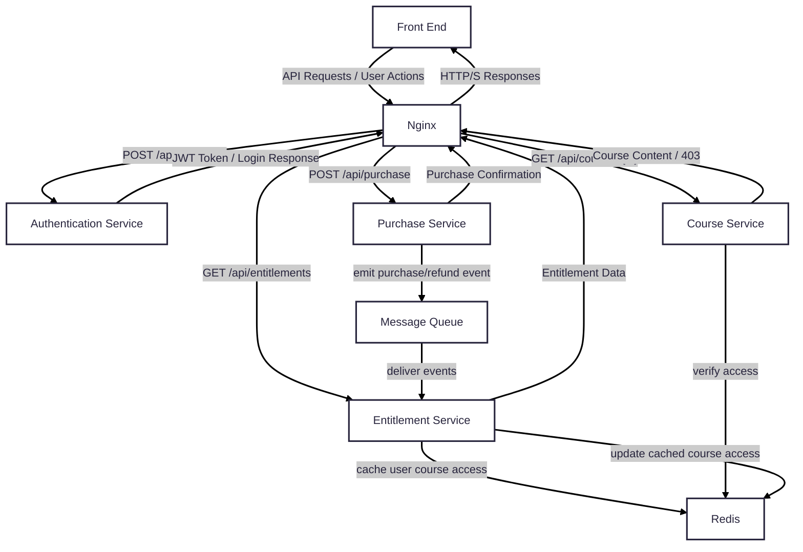

# Français Tout-en-Un

**Français Tout-en-Un** is a modern web application designed to facilitate learning the French language. Built on a distributed microservices architecture, it delivers a seamless and performant user experience.

## Tech Stack
- **Backend**: Python (FastAPI + Uvicorn), SQLAlchemy
- **Database**: PostgreSQL, Redis
- **Messaging**: Kafka
- **Containerization**: Docker
- **Frontend**: React
- **Authentication**: JWT
- **API Gateway**: Nginx

## Requirements
To run the application locally, ensure you have the following tools installed:
- [Docker](https://www.docker.com/get-started)
- [Docker Compose](https://docs.docker.com/compose/install/)

## Installation and Setup

**Run the Application**:
   
```
docker-compose down && docker-compose up --build
```

**Access the Application**:
```
http://localhost
```

## Development
**Restart & build single microservice**:
```
docker-compose up -d --no-deps --build --force-recreate <service_name>
```
**Start the React frontend in development mode:**
```
yarn dev
```

## High-Level Interaction Diagram
